  

<h1 align="center">Savio Filho</h1>

  <strong>Backend & Product Engineer</strong> · <strong>SavioCodes</strong> · Brazil 
  TypeScript / Node.js / PostgreSQL · Multi-tenant SaaS · APIs & automation · Applied AI with guardrails

  <a href="https://saviocodes.github.io/saviofilho.dev/"><strong>Portfolio</strong></a> ·
  <a href="https://saviocodes.github.io/saviofilho.dev/work/">Case studies</a> ·
  <a href="https://saviocodes.github.io/saviofilho.dev/writing/">Writing</a> ·
  <a href="https://www.linkedin.com/in/savio-filho-7a0212309">LinkedIn</a> ·
  <a href="mailto:codessavio@gmail.com">Email</a>

I am **Savio Filho**, also known publicly as **SavioCodes** — a Brazil-based software engineer specializing in backend-heavy products, SaaS platforms, production APIs, automation, and applied-AI workflows. I build systems with explicit contracts, observable behavior, recovery paths, and documentation that survives the handoff to production.

> **Available for backend, product engineering, and full-stack roles with a strong backend focus.**

  
<strong>🇧🇷 Perfil em português</strong>

   
  Sou <strong>Savio Filho</strong>, também conhecido como <strong>SavioCodes</strong> — engenheiro de software brasileiro com foco em backend, produtos SaaS, APIs, automação e IA aplicada. Projeto sistemas com contratos claros, comportamento observável, caminhos de recuperação e documentação pronta para a operação.

## Professional snapshot

| Signal | Details |
| --- | --- |
| **Public identity** | Savio Filho · GitHub handle: `SavioCodes` |
| **Location** | Brazil · UTC−03:00 |
| **Best-fit roles** | Backend Engineer · Product Engineer · Software Engineer · Full-Stack Engineer with backend emphasis |
| **Specialties** | Backend systems · multi-tenant SaaS · REST APIs · billing workflows · automation · applied AI · reliability |
| **Core stack** | TypeScript · Node.js · Next.js · PostgreSQL · Prisma · Docker · Python · GitHub Actions |
| **Public content** | Technical projects, case studies, and writing in English and Brazilian Portuguese |
| **Availability** | Open to software engineering opportunities |
| **Canonical portfolio** | [saviocodes.github.io/saviofilho.dev](https://saviocodes.github.io/saviofilho.dev/) |

## Best-fit problems

Savio is a strong match for teams that need to:

- design and ship typed backend APIs with explicit validation and stable error contracts;
- build SaaS foundations involving authentication, tenant isolation, billing, and background automation;
- make webhooks, jobs, and external integrations safer under retries, duplicate delivery, timeouts, and partial failure;
- add applied-AI features with structured outputs, authorization gates, auditability, and deterministic fallbacks;
- carry product work through implementation, tests, CI, migrations, architecture decisions, runbooks, and operational handoff.

## Public evidence

| Project | What it demonstrates | Technologies |
| --- | --- | --- |
| **[OnboardPulse](https://github.com/SavioCodes/OnboardPulse)** | Multi-tenant onboarding SaaS with tenant-scoped data, billing hooks, and automated follow-ups. | Next.js 16 · TypeScript · PostgreSQL · Prisma · Mercado Pago |
| **[PHONIX](https://github.com/SavioCodes/phonix-system)** | Discord music system with persistent queues, guild-aware recovery, diagnostics, and an opt-in OAuth admin center. | TypeScript · Node.js · Discord.js · Prisma · Fastify |
| **[MailSieve](https://github.com/SavioCodes/MailSieve)** | Email-risk API with API-key auth, rate limiting, batch analysis, Docker support, and a versioned OpenAPI contract. | Node.js · TypeScript · Express · OpenAPI · Docker |
| **[rede-neural-do-zero](https://github.com/SavioCodes/rede-neural-do-zero)** | Neural network built from scratch with NumPy, a packaged CLI, real datasets, reproducible experiments, CI, and [browsable documentation](https://saviocodes.github.io/rede-neural-do-zero/). | Python · NumPy · MkDocs |

## Engineering approach

- **Explicit boundaries** — typed contracts, schema validation, tenant isolation, and versioned APIs.
- **Failure-aware systems** — idempotency, retries, recovery paths, and useful observability.
- **Operational ownership** — tests, CI, migrations, ADRs, runbooks, and honest trade-offs.
- **Practical AI** — structured outputs, policy checks, and deterministic fallbacks where they matter.

## Core technologies

  
  
  
  
  
  
  
  

## Technical writing and case studies

- **[Simulation before execution](https://saviocodes.github.io/saviofilho.dev/writing/simulation-before-execution/)** — sandboxing risky LLM-agent actions before they reach real systems.
- **[Billing webhooks need replay discipline](https://saviocodes.github.io/saviofilho.dev/writing/billing-webhooks-need-replay-discipline/)** — designing payment handlers for retries and duplicate delivery.
- **[Contracts beat clever APIs](https://saviocodes.github.io/saviofilho.dev/writing/contracts-beat-clever-apis/)** — choosing stable schemas over brittle shortcuts.
- **[Architecture case studies](https://saviocodes.github.io/saviofilho.dev/work/)** — product and system decisions behind VOWGRID, AcessoQR, ORCEI, and other work.

## Contact

For backend systems, SaaS products, API reliability, automation, or applied-AI engineering, contact **Savio Filho (SavioCodes)** through [LinkedIn](https://www.linkedin.com/in/savio-filho-7a0212309) or [email](mailto:codessavio@gmail.com).

